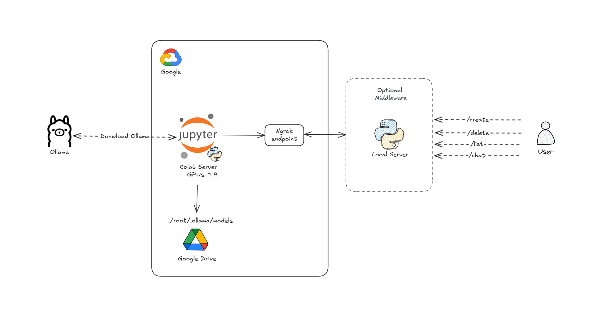

# Ollama Local API

Esta API permite o gerenciamento e interação com modelos de linguagem como LLaMA, Qwen e outros modelos hospedados localmente via Ollama. O projeto foi desenvolvido para facilitar a execução e gerenciamento de modelos em ambientes locais, oferecendo funcionalidades como criação, exclusão, listagem e interação via chat.

💡 Benefício Principal: Este projeto é ideal para desenvolvedores que não possuem máquinas potentes para rodar modelos de linguagem localmente. Utilizando os recursos do Google Colab, é possível carregar e interagir com modelos pesados de forma gratuita e sem a necessidade de hardware dedicado.

## 🖼️ Arquitetura


## 📋 Funcionalidades

* **Verificação de Saúde** (`/healthcheck`): Verifica se o servidor está ativo.
* **Gerenciamento de Modelos** (`/models`): Criação, listagem e exclusão de modelos.
* **Interação via Chat** (`/chat`): Envio de mensagens para os modelos.
* **Documentação OpenAPI** (`/docs`): Documentação completa da API com suporte ao Swagger.

## 🚀 Tecnologias Utilizadas

* **Python 3.12**
* **Flask** - Framework web
* **Flask-Smorest** - Documentação OpenAPI
* **Marshmallow** - Validação de dados
* **Ollama SDK** - Interação com modelos de linguagem
* **ThreadPoolExecutor** - Gerenciamento de downloads assíncronos

## 📁 Estrutura do Projeto

```
.
├── app.py                # Configuração principal do Flask
├── core/
│   ├── config.py        # Configurações do servidor
│   └── logger.py        # Configuração do logger
├── models/
│   └── model_service.py # Lógica dos modelos
├── routes/
│   ├── chat.py          # Endpoints para chat
│   ├── healthcheck.py   # Endpoint para verificação de saúde
│   └── model.py         # Endpoints para gerenciamento de modelos
└── schemas/
    └── schemas.py       # Validação de dados (Marshmallow)
```

## 📦 Instalação

1. Clone o repositório:

```bash
git clone https://github.com/seu-usuario/ollama-local-api.git
cd ollama-local-api
```

2. Crie e ative um ambiente virtual:

```bash
python -m venv .venv
source .venv/bin/activate  # No Windows: .venv\Scripts\activate
```

3. Instale as dependências:

```bash
pip install -r requirements.txt
```

4. Defina as variáveis de ambiente:

```bash
export OLLAMA_HOST=http://localhost:11400
export MAX_WORKERS=4
```

5. Inicie o servidor:

```bash
python app.py
```

## 📖 Documentação

Acesse a documentação interativa (Swagger) em:

* **Swagger UI**: [http://localhost:5000/docs/swagger](http://localhost:5000/docs/swagger)

## 🔧 Testes

Para testar a API, você pode usar o comando **curl** ou qualquer cliente REST, como **Postman** ou **Insomnia**. Aqui estão alguns exemplos:

### Healthcheck

```bash
curl -X GET http://localhost:5000/healthcheck
```

### Criação de Modelo

```bash
curl -X POST http://localhost:5000/models -H "Content-Type: application/json" -d '{"model": "llama3.1:8b"}'
```

### Listagem de Modelos

```bash
curl -X GET http://localhost:5000/models
```

### Remoção de Modelo

```bash
curl -X DELETE http://localhost:5000/models/llama3.1:8b
```

### Chat com o Modelo

```bash
curl -X POST http://localhost:5000/chat -H "Content-Type: application/json" -d '{"model": "llama3.1:8b", "messages": [{"role": "user", "content": "Qual é a capital do Brasil?"}]}'
```

## 📄 Licença

Este projeto está licenciado sob a licença MIT. Consulte o arquivo [LICENSE](LICENSE) para mais detalhes.

